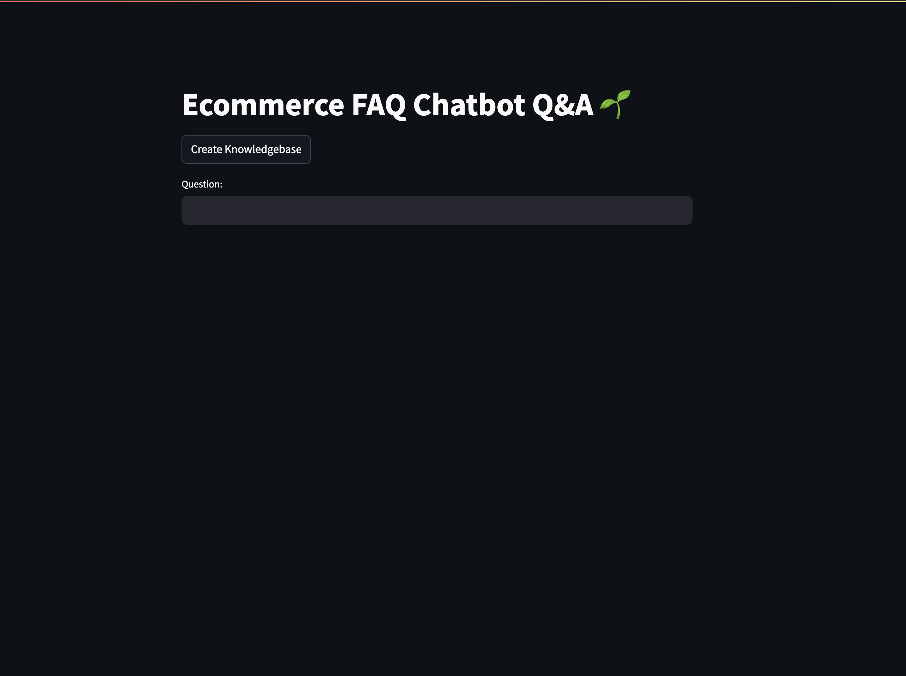

# 🤖 Chatbot Q&A

A smart, Streamlit-based Question & Answer chatbot is a RAG based application designed for eCommerce FAQs, powered by LLMs, embeddings, and vector search!




---

## 🚀 Overview

**chatbot-q-and-a** is an intelligent chatbot application built to answer common questions from an eCommerce FAQ dataset. It utilizes powerful LLMs and vector-based semantic search to deliver accurate and summarized responses. If the bot doesn't know the answer, it politely says so — no hallucinations here!

This app supports regenerating embeddings through a button on the UI, offering flexibility to refresh or update the knowledge base with ease.

---

## 🧠 Features

- ⚡ Embedding-based question retrieval with FAISS
- 📚 Dataset: [ecommerce_FAQ_chatbot_dataset on Kaggle](https://www.kaggle.com/datasets/saadmakhdoom/ecommerce-faq-chatbot-dataset/data)
- 🔍 Uses `hkunlp/instructor-large` from HuggingFace
- 🧠 Summarizes multiple similar answers using an LLM
- 💬 Natural UI using Streamlit
- 🛠️ Local inference using [Ollama](https://ollama.com/) + Qwen2 LLM
- 🔁 One-click embedding regeneration from UI
- ❌ Gracefully handles out-of-scope questions by responding with "I don't know."

---

## 🛠️ Tech Stack

| Tool / Package                 | Purpose                                   |
| ------------------------------ | ----------------------------------------- |
| `streamlit`            | Frontend web UI                           |
| `langchain`            | LLM & prompt orchestration                |
| `langchain-community`   | Integrations with external tools          |
| `faiss-cpu`       | Fast similarity search on CPU             |
| `tiktoken`              | Tokenization support                      |
| `protobuf`             | Serialization (LangChain & Ollama)        |
| `sentence-transformers` | Transformer embedding utilities           |
| `InstructorEmbedding`   | HuggingFace embedding wrapper             |
| `jq`                    | JSON parsing (if used in post-processing) |

---

## 📂 Dataset

We are using the [ecommerce_FAQ_chatbot_dataset](https://www.kaggle.com/datasets/saadmakhdoom/ecommerce-faq-chatbot-dataset/data), which includes real-world Q&A pairs commonly asked by customers.

---

## 🔧 How It Works

1. **Embedding Creation**

   - The Q&A pairs are embedded using the `hkunlp/instructor-large` model from HuggingFace.
   - These embeddings are stored using FAISS for efficient similarity search.

2. **User Question Flow**

   - User asks a question via the Streamlit interface.
   - The question is converted to an embedding using the same model.
   - FAISS retrieves the closest match(es) from the dataset.
   - The matched answer(s) are fed to the LLM (Qwen2 via Ollama).
   - If multiple matches are returned, the LLM summarizes them.
   - If no good match is found, the LLM responds: _"I don't know."_

3. **Knowledge Base Regeneration**
   - A dedicated UI button allows regenerating embeddings from scratch.


## 🚀 Getting Started

### 1️⃣ Install Ollama and Pull the Llama3 Model

Make sure you have [Ollama](https://ollama.com/) installed.

Then pull the `qwen2` model locally:

```bash
ollama pull qwen2
```

### 2️⃣ Clone the Repository

```bash
git clone https://github.com/js-kalsi/restaurent-genai.git
cd restaurent-genai
```

### 3️⃣ Set Up a Virtual Environment & Install Dependencies

We recommend using a virtual environment:

```bash
python -m venv venv
source venv/bin/activate  # On Windows: venv\Scripts\activate
```

Then install dependencies:

```bash
pip install -r requirements.txt
```

### 4️⃣ Run the App

Launch the Streamlit app:

```bash
streamlit run app.py
```

The app will open in your default web browser. Select a cuisine, and let the AI generate a restaurant concept for you!
